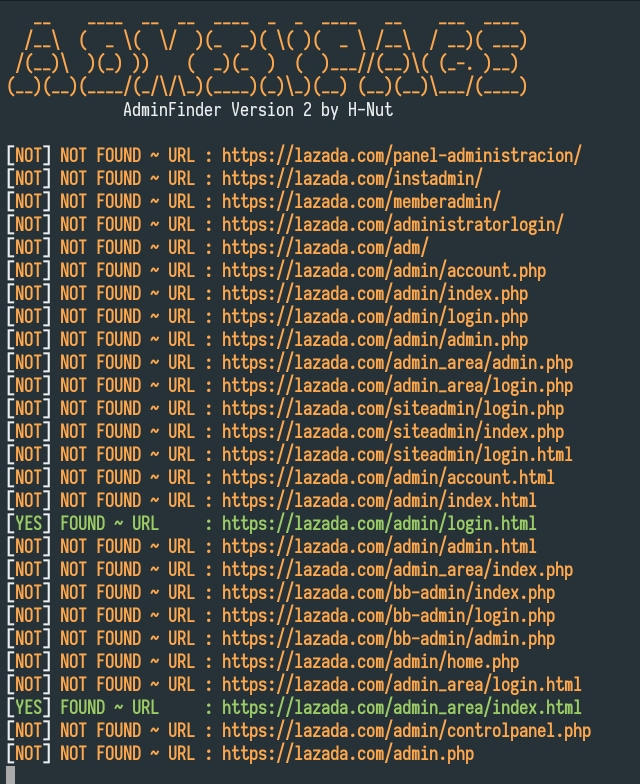

# AdminPage🚀
AdminPage is a tool to make it easier to find a login page on a website

### Usage🔥
<p align="center">
  <a name="top" href="#octocat-hi-there-thanks-for-visiting-">
     
  </a>
</p>


### Result✨
<p align="center">
  <a name="top" href="#octocat-hi-there-thanks-for-visiting-">
     
  </a>
</p>


# Installation💥
<details open>
<summary> Android / Linux</summary>

- ```bash
  $ apt update && apt upgrade
  ```

- ```bash
  $ apt install python2 git -y
  ```
- ```bash
  $ apt install pip 
  ```
- ```bash
  $ pip install requests

- ```bash
  $ git clone https://github.com/SyborgSyndicate/AdminPage
  ```

- ```bash
  $ cd AdminPage
  ```

- ```bash
  $ python page.py
  ```
